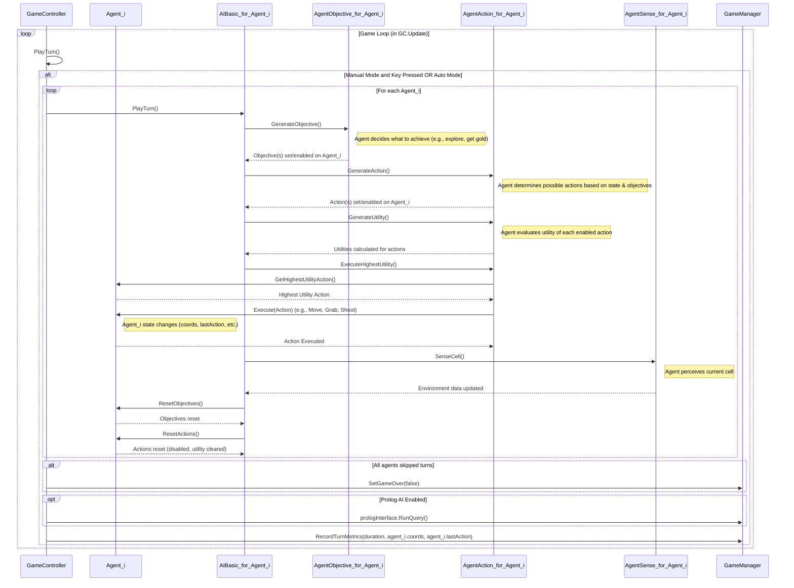
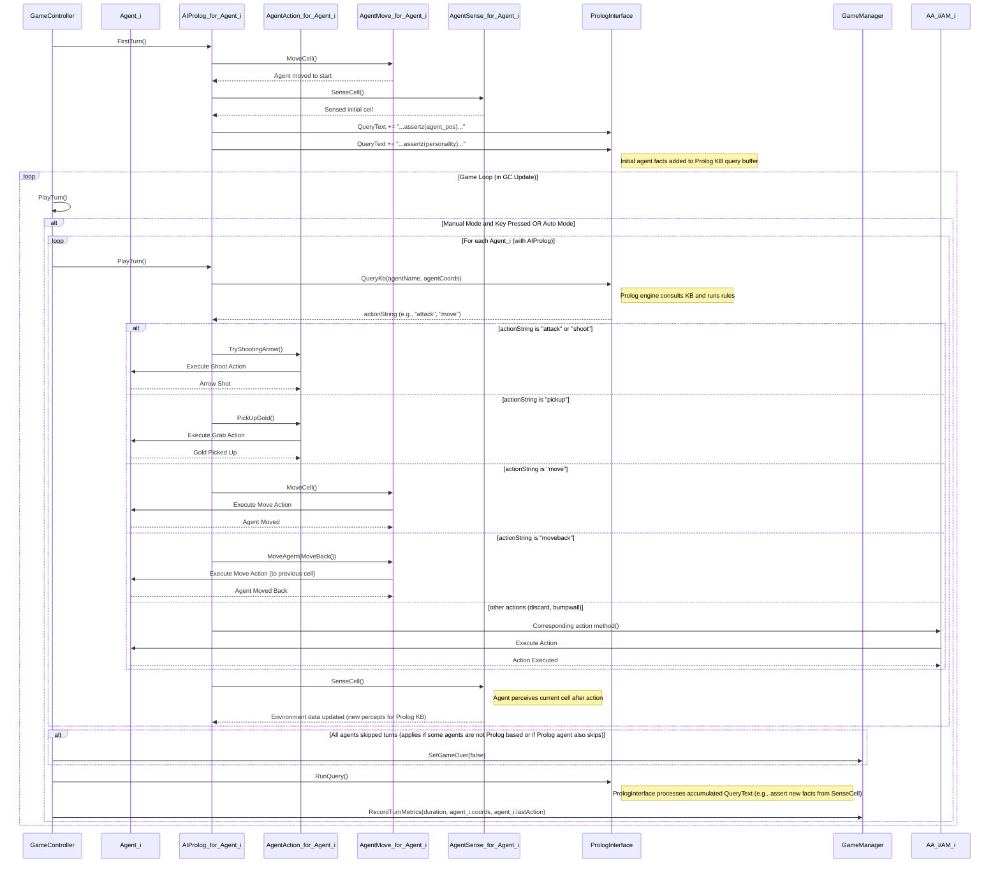

# WumpusWorld Agent AI Playground


[](https://opensource.org/)

**Welcome to the WumpusWorld Agent AI Playground!** This project offers an extended and interactive C# implementation of the classic Wumpus World logic game, as featured in "Artificial Intelligence: A Modern Approach" by Russell & Norvig. It serves as a sandbox for exploring and comparing various AI techniques for agent control, from simple rule-based systems to sophisticated logic programming with Prolog.

## Table of Contents
- [Key Features](#key-features)
- [Showcase Video](#showcase-video)
- [The Game: Rules & Objective](#the-game-rules--objective)
- [Technologies Used](#technologies-used)
- [Getting Started](#getting-started)
  - [Prerequisites](#prerequisites)
  - [Setup Instructions](#setup-instructions)
- [Running the Game](#running-the-game)
  - [Configuration Options](#configuration-options)
- [How to Play](#how-to-play)
  - [Controls](#controls)
- [AI Agents Overview](#ai-agents-overview)
  - [C#-based AIs](#c-based-ais)
  - [Prolog-based AI](#prolog-based-ai)
  - [Experimental LLM AI](#experimental-llm-ai)
- [Technical Deep Dive](#technical-deep-dive)
  - [Agent Architecture](#agent-architecture)
  - [Prolog Integration Details](#prolog-integration-details)
  - [C# Ontology Classes Explained](#c-ontology-classes-explained)
  - [Game Loop Diagrams](#game-loop-diagrams)
    - [Game Loop with AIBasic](#game-loop-with-aibasic)
    - [Game Loop with AIProlog](#game-loop-with-aiprolog)
  - [Data Logging](#data-logging)
- [Repository Structure](#repository-structure)
- [Roadmap / Future Work](#roadmap--future-work)
- [Contributing](#contributing)
- [License](#license)
- [Acknowledgments](#acknowledgments)
- [Reporting Issues](#reporting-issues)

---

## Key Features
*   **Classic Wumpus World Gameplay**: Navigate a dangerous cave, avoid pits and the Wumpus, find gold, and return safely.
*   **Multiple AI Control Mechanisms**:
    *   **Basic Rule-Based AI**: A simple `if-then-else` logic ([`AIBasic.cs`](Assets/Scripts/Agent/AI/AIBasic.cs)).
    *   **Finite State Machine**: Agent behavior driven by states and transitions ([`AIFiniteStateMachine.cs`](Assets/Scripts/Agent/AI/AIFiniteStateMachine.cs)).
    *   **Behavior Tree**: Utilizes the [Fluid Behaviour Tree](https://github.com/ashblue/fluid-behaviour-tree) library for modular AI design ([`AIBehaviourTree.cs`](Assets/Scripts/Agent/AI/AIBehaviourTree.cs)).
    *   **Prolog-Based Logical AI**: Employs SWI-Prolog for sophisticated reasoning, using a defined knowledge base and ontologies ([`AIProlog.cs`](Assets/Scripts/Agent/AI/AIProlog.cs) with `.pl` files).
    *   **Experimental Large Language Model (LLM) AI**: Initial exploration into LLM-driven agent control ([`AILargeLanguageModel.cs`](Assets/Scripts/Agent/AI/AILargeLanguageModel.cs)).
*   **Configurable Game Environment**: Customize grid size, number of pits, Wumpuses, gold, agents, and the random seed for reproducible worlds.
*   **Agent Personalization**: Assign personality traits (e.g., Brave, Coward) that influence AI decision-making, especially for the Prolog AI.
*   **Dual World Visualization**: See both the agent's limited perception of the world and the true state of the world side-by-side.
*   **Detailed Session Logging**: Game configuration, agent actions, positions, and turn durations are logged to JSON files for analysis.
*   **Flexible Play Modes**: Supports manual control, semi-automatic (action-by-action), and fully automatic gameplay.

---

## Showcase Video
A small demo of this project is available by clicking on the following image:

  [](https://youtu.be/dhP5YQKlUbU)

**Visual Key in Demo:**
*   **Left Side**: The world as perceived by the agent.
*   **Right Side**: The actual, complete world state.
*   **Cell Colors**:
    *   **Gray**: Start location.
    *   **Light Blue**: Visited cells.
    *   **Green**: Safe cells.
    *   **Red**: Dangerous cells (Wumpus or Pit).
    *   **Orange**: Uncertain cells.
    *   **Black**: Walls (inaccessible).

---

## The Game: Rules & Objective
*   The game unfolds in a grid-based cave, home to pits, gold, and the fearsome Wumpus.
*   **Objective**: The agent must find the gold and return to the starting cell without perishing.
*   **Hazards**: Falling into a pit or encountering a Wumpus is fatal.
*   **Perception**:
    *   A **Breeze** in a cell indicates an adjacent pit.
    *   A **Stench** in a cell signals a Wumpus in a neighboring cell.
*   **Agent Abilities**:
    *   Move one cell at a time (up, down, left, right).
    *   Shoot a limited number of arrows to attempt to kill a Wumpus.
*   **Game End**: The game concludes if the agent dies or successfully exits the cave with the gold.

---

## Technologies Used
*   **Game Engine**: Unity (programmed in C#)
*   **Logic Programming Engine**: SWI-Prolog (for the `AIProlog` agent)
*   **Behavior Tree Library**: [Fluid Behaviour Tree](https://github.com/ashblue/fluid-behaviour-tree) by CleverCrow
*   **Development Environment**: Unity Editor, IDE for C# (e.g., Visual Studio, Rider)
*   **Version Control**: Git & GitHub

---

## Getting Started

### Prerequisites
*   **Unity Game Engine**: Tested with Unity version 6 and newer. For the exact version used during development, please see the `ProjectSettings/ProjectVersion.txt` file. Download from [unity.com/download](https://unity.com/download).
*   **SWI-Prolog**: Required for the Prolog-based AI. Tested with version 9 and newer. Download from [swi-prolog.org/Download.html](https://www.swi-prolog.org/Download.html).
    *   Ensure that the SWI-Prolog executable (`swipl`) is added to your system's PATH environment variable.

### Setup Instructions
1.  **Clone the Repository**:
    ```bash
    git clone https://github.com/sylvainlapeyrade/WumpusWorld.git && cd WumpusWorld
    ```
2.  **Install SWI-Prolog**: If not already installed, download and install it using the link above. Verify it's in your PATH.
3.  **Open with Unity Hub**:
    *   Launch Unity Hub.
    *   Click on "Open" and select "Add project from disk".
    *   Navigate to the cloned `WumpusWorld` repository folder and select it.
4.  **Load Project in Unity Editor**:
    *   Unity will import the project and generate necessary library files. This might take a few minutes on the first open.
5.  **Open the Main Scene**:
    *   In Unity's "Project" window, navigate to the `Assets/Scenes/` folder.
    *   Double-click `MainGameScene.unity` (or your primary game scene file) to load it.

---

## Running the Game

<p align="center">
  
</p>
<p align="center"><em>GameManager component in the Unity Inspector for game configuration.</em></p>

### Configuration Options
Before starting, you can customize the game environment:
1.  In the Unity "Hierarchy" window, select the **"Grid"** GameObject.
2.  In the "Inspector" window, locate the **"Game Manager (Script)"** component and adjust the following settings:

    *   **Is Game Over**: (Read-only during play) Indicates if the game has ended. Can be manually set to freeze the game.
    *   **Is Mode Auto**: Enables continuous automatic play for agents.
        *   **Timer Interval**: If "Is Mode Auto" is true, this sets the delay (in seconds, e.g., 0.5 for 500ms) between each agent's automatic actions.
    *   **Random Seed**: An integer used to initialize the random number generator. The same seed will always produce the same world layout (pits, Wumpus, gold).
    *   **Grid Min & Max**: Vector2Int values defining the grid's dimensions (e.g., Min (0,0) and Max (15,15) creates a 16x16 grid).
    *   **Tile Size**: Visual spacing between cell centers (primarily affects appearance).
    *   **Nb Pit, Wumpus, Gold, Agent**: Specify the quantity of each game element. Ensure the total number of fixed elements (pits, Wumpus, gold, start positions for agents) does not exceed available grid cells.
    *   **AI Type**: Choose the agent's control logic from the dropdown:
        *   `Basic`: Simple ad-hoc if-then-else rules ([`AIBasic.cs`](Assets/Scripts/Agent/AI/AIBasic.cs)).
        *   `FiniteStateMachine`: Behavior driven by a finite state machine ([`AIFiniteStateMachine.cs`](Assets/Scripts/Agent/AI/AIFiniteStateMachine.cs)).
        *   `BehaviourTree`: AI using a behavior tree structure ([`AIBehaviourTree.cs`](Assets/Scripts/Agent/AI/AIBehaviourTree.cs)).
        *   `Prolog`: Decisions made by querying an SWI-Prolog knowledge base ([`AIProlog.cs`](Assets/Scripts/Agent/AI/AIProlog.cs)).
        *   `LargeLanguageModel`: Experimental AI using an LLM (currently in development, [`AILargeLanguageModel.cs`](Assets/Scripts/Agent/AI/AILargeLanguageModel.cs)).
    *   **Personalities**: Assign personality traits to agents (e.g., Brave, Coward, Cupid). Multiple traits can be selected. For the `AIProlog` AI, these personalities are asserted as facts into its knowledge base, influencing its decisions based on Prolog rules.

3.  Click the **Play button** (►) at the top of the Unity Editor to start the game with your chosen settings.

---

## How to Play

### Controls
*   **Manual Control**:
    *   Use the **directional arrow keys (Up, Down, Left, Right)** to have the agent attempt to move in the chosen direction. The AI still governs whether the move is made and what specific action results (e.g., moving, bumping a wall).
*   **Semi-Automatic Play**:
    *   Press the **Space bar** to make the agent perform one AI-determined action.
    *   Press the **Return (Enter) key** for what the user describes as a "randomized action" (this might be AI-specific randomness or a general turn trigger).
*   **Fully Automatic Play**:
    *   Enable the **"Is Mode Auto"** checkbox in the Game Manager settings (see [Configuration Options](#configuration-options)) for continuous, hands-free agent actions based on the set "Timer Interval".
*   **Other Controls**:
    *   **Escape Key**: Ends the game and, if in the Unity Editor, stops play mode.
    *   **Backspace Key**: Captures a screenshot and saves it to a "Screenshots" folder within your project directory.

---

## AI Agents Overview
This project explores various AI paradigms for controlling the Wumpus World agent.

### C#-based AIs
These AIs are implemented directly in C# within the Unity environment.
*   **[`AIBasic.cs`](Assets/Scripts/Agent/AI/AIBasic.cs)**: A straightforward rule-based system. It uses C# [Ontology classes](#c-ontology-classes-explained) (like [`Objective.cs`](Assets/Scripts/Ontology/Objective.cs) and [`Action.cs`](Assets/Scripts/Ontology/Action.cs)) to generate goals, evaluate the utility of possible actions, and execute the best one.
*   **[`AIFiniteStateMachine.cs`](Assets/Scripts/Agent/AI/AIFiniteStateMachine.cs)**: Implements a classic Finite State Machine where the agent transitions between predefined states (e.g., Exploring, Attacking, Retreating) based on environmental perceptions.
*   **[`AIBehaviourTree.cs`](Assets/Scripts/Agent/AI/AIBehaviourTree.cs)**: Leverages the [Fluid Behaviour Tree](https://github.com/ashblue/fluid-behaviour-tree) library to create a modular and hierarchical tree of behaviors (sequences, selectors, conditions, actions) that dictate the agent's decisions.

### Prolog-based AI
*   **[`AIProlog.cs`](Assets/Scripts/Agent/AI/AIProlog.cs)**: This AI delegates its decision-making to an external SWI-Prolog engine.
    *   **Knowledge Representation**: Its understanding of the game world, actions, objectives, and personalities is defined by a set of structured Prolog files (`.pl`) located in `Assets/StreamingAssets/prolog_default/`. These include:
        *   [`main.pl`](Assets/StreamingAssets/prolog_default/main.pl): The core reasoning rules and entry point.
        *   [`action.pl`](Assets/StreamingAssets/prolog_default/action.pl): Ontology for game actions.
        *   [`element.pl`](Assets/StreamingAssets/prolog_default/element.pl): Ontology for game elements (Wumpus, Pit, Gold, Cell types).
        *   [`objective.pl`](Assets/StreamingAssets/prolog_default/objective.pl): Ontology for agent objectives.
        *   [`personality.pl`](Assets/StreamingAssets/prolog_default/personality.pl): Ontology for agent personalities.
    *   **Interface**: Communication is handled by [`PrologInterface.cs`](Assets/Scripts/Prolog/PrologInterface.cs), which sends facts (agent perceptions, selected C# `Personalities`) to the Prolog KB and queries it for the next action.

### Experimental LLM AI
*   **[`AILargeLanguageModel.cs`](Assets/Scripts/Agent/AI/AILargeLanguageModel.cs)**: An exploratory AI aiming to use a Large Language Model for agent control. This is currently in the early stages of development and not fully functional.

---

## Technical Deep Dive

### Agent Architecture
The agent's behavior and interaction with the world are managed by several key C# scripts:
*   **[`Agent.cs`](Assets/Scripts/Agent/Agent.cs)**: The core script for an agent. It initializes the agent, holds its state (like coordinates, inventory), and manages its various components (AI, personality, actions, objectives).
*   **[`AgentSense.cs`](Assets/Scripts/Agent/AgentSense.cs)**: Handles how the agent perceives its environment (e.g., detecting breezes, stenches). Perceptual information is crucial for decision-making.
*   **[`AgentMove.cs`](Assets/Scripts/Agent/AgentMove.cs)**: Manages all movement-related logic for the agent, including executing moves to adjacent cells and handling collisions with walls.
*   **[`AgentAction.cs`](Assets/Scripts/Agent/AgentAction.cs)**: Responsible for executing non-movement actions, such as picking up gold or shooting an arrow.
*   **[`AgentObjective.cs`](Assets/Scripts/Agent/AgentObjective.cs)**: Used primarily by the `AIBasic` AI (and potentially adaptable for others), this component helps in generating high-level goals for the agent (e.g., explore, find gold).

### Prolog Integration Details (`AIProlog`)
The Prolog-based AI ([`AIProlog.cs`](Assets/Scripts/Agent/AI/AIProlog.cs)) leverages an external SWI-Prolog engine for its decision-making:
*   **[`PrologInterface.cs`](Assets/Scripts/Prolog/PrologInterface.cs)**: This script acts as a bridge between Unity (C#) and SWI-Prolog. It uses SWI-Prolog's Machine Query Interface (MQI) to send queries and receive results. It directly consults `main.pl` upon initialization.
*   **Knowledge Base Files (in `Assets/StreamingAssets/prolog_default/`)**:
    *   **`main.pl`**: This is the primary Prolog file consulted by [`PrologInterface.cs`](Assets/Scripts/Prolog/PrologInterface.cs). It contains the core reasoning logic, predicates, and rules that drive the agent's behavior. It is responsible for consulting the other specialized ontology `.pl` files.
    *   **Ontology Files**: `action.pl`, `element.pl`, `objective.pl`, and `personality.pl`. These files define the detailed ontologies—hierarchies, properties, and relationships—for game actions, elements (like Wumpus, pits, gold, cell types), agent objectives, and personality traits. They provide the structured knowledge representation that `main.pl` uses for reasoning.
*   **Operation**:
    1.  During its turn, [`AIProlog.cs`](Assets/Scripts/Agent/AI/AIProlog.cs) gathers current agent state (e.g., coordinates, perceived cell contents via [`AgentSense.cs`](Assets/Scripts/Agent/AgentSense.cs)) and selected C# `Personalities` (from `GameManager`).
    2.  These are asserted as temporary facts into the Prolog knowledge base via [`PrologInterface.cs`](Assets/Scripts/Prolog/PrologInterface.cs). For instance, a selected C# `Personality` like "Brave" becomes a Prolog fact `brave(agentName, _)`, which `personality.pl` and `main.pl` can then use in their reasoning.
    3.  [`AIProlog.cs`](Assets/Scripts/Agent/AI/AIProlog.cs) then calls `PrologInterface.QueryKb(...)`, sending the agent's name and coordinates. This triggers the Prolog engine to consult its rule set using all available facts.
    4.  The Prolog engine returns a string representing the suggested action (e.g., "move", "shoot", "pickup").
    5.  [`AIProlog.cs`](Assets/Scripts/Agent/AI/AIProlog.cs) then calls the appropriate methods on [`AgentMove.cs`](Assets/Scripts/Agent/AgentMove.cs) or [`AgentAction.cs`](Assets/Scripts/Agent/AgentAction.cs) to execute this action.
    6.  The `GameController` also calls `PrologInterface.RunQuery()` at the end of the turn to process any globally accumulated Prolog queries or assertions.

### C# Ontology Classes Explained
Located in `Assets/Scripts/Ontology/`, these C# classes define the conceptual building blocks for game elements and AI logic primarily for the **C#-based AI systems** (`AIBasic`, `AIBehaviourTree`, `AIFiniteStateMachine`) and for representing these concepts within the general C# game logic.
*   **[`Action.cs`](Assets/Scripts/Ontology/Action.cs)**: Base class for all actions an agent can perform (e.g., `Move`, `Attack`, `PickUp`). Includes a `Utility` property used by `AIBasic`.
*   **[`Cell.cs`](Assets/Scripts/Ontology/Cell.cs)**: Represents a cell in the game grid and its properties (e.g., `isVisited`, `hasPit`).
*   **[`Element.cs`](Assets/Scripts/Ontology/Element.cs)**: Base class for game objects like Wumpus, Pit, Gold.
*   **[`Objective.cs`](Assets/Scripts/Ontology/Objective.cs)**: Base class for agent objectives, used by `AIBasic` (e.g., `Explore`, `GetGold`).
*   **[`Personality.cs`](Assets/Scripts/Ontology/Personality.cs)**: Defines various C# personality components (e.g., `Brave`, `Coward`) that can be attached to agents. The names of these selected C# personalities are converted to facts for the Prolog AI, which then uses its own Prolog-defined ontologies (e.g., `personality.pl`) to interpret and reason about these traits.

While the C# `Ontology` classes and the Prolog `.pl` ontology files may cover similar conceptual domains (actions, personalities, etc.), they serve different AI systems. The Prolog ontologies are specifically for the `AIProlog` AI and are defined purely in Prolog, whereas the C# classes are for the C# AIs and engine-level representation.

### Game Loop Diagrams

#### Game Loop with `AIBasic`
This diagram illustrates the main sequence of calls and interactions during a single iteration of the game loop when using the `AIBasic` AI logic.

**`AIBasic` Participants:**
*   `GC`: `GameController` - Manages the overall turn flow.
*   `Agent_i`: An instance of the `Agent` class.
*   `AIBasic_i`: The `AIBasic` component.
*   `AO_i`: The `AgentObjective` component.
*   `AA_i`: The `AgentAction` component.
*   `AS_i`: The `AgentSense` component.
*   `GM`: `GameManager` - Holds global game state.

#### Game Loop with `AIProlog`
When the AI Type is set to `Prolog`, the `AIProlog` component handles decision-making by interacting with the `PrologInterface`.

**`AIProlog` Key Participants:**
*   `AIProlog_i`: The `AIProlog` component.
*   `PI`: `PrologInterface` - Bridge to the SWI-Prolog engine.
*   `AM_i`: The `AgentMove` component.

### Data Logging
The game includes a feature to log data from each session:
*   When a game ends (or if `saveData` is enabled in `GameManager`), game metrics and agent history are saved to a JSON file.
*   The data includes: game configuration (seed, grid size, entity counts, AI type, personalities), game outcome, turn durations, and for each agent, a list of all actions taken and their positions at each turn.
*   Files are saved in a `data/` directory (created automatically at the project's root level if it doesn't exist) with a naming convention like: `data/{gridMax.x}x{gridMax.y}-{nbAgent}a-{nbWumpus}wp-{nbGold}g-{string.Join("-", personalities)}-{aiType}.json`.

---

## Repository Structure
This section outlines the key directories and files in the project.
```
WumpusWorld
├── Assets
│   ├── Scripts                     # Contains all C# game logic and AI scripts
│   │   ├── Agent
│   │   │   ├── AI                  # Different AI implementations for the agent
│   │   │   │   ├── AIBasic.cs
│   │   │   │   ├── AIBehaviourTree.cs
│   │   │   │   ├── AIFiniteStateMachine.cs
│   │   │   │   ├── AILargeLanguageModel.cs
│   │   │   │   ├── AIProlog.cs
│   │   │   ├── Agent.cs            # Core agent logic and state management
│   │   │   ├── AgentAction.cs      # Handles agent actions like shooting, picking up items
│   │   │   ├── AgentMove.cs        # Manages agent movement
│   │   │   ├── AgentObjective.cs   # Defines agent objectives (used by AIBasic)
│   │   │   ├── AgentSense.cs       # Handles agent perception of the environment
│   │   ├── Ontology              # C# classes defining game concepts (actions, elements, etc.) for C# AIs
│   │   │   ├── Action.cs
│   │   │   ├── Cell.cs
│   │   │   ├── Element.cs
│   │   │   ├── Objective.cs
│   │   │   ├── Personality.cs
│   │   ├── Prolog                # C# scripts for interfacing with the Prolog engine
│   │   │   ├── PrologInterface.cs  # Main C# to Prolog bridge
│   │   │   ├── PrologMQI.cs        # Machine Query Interface for SWI-Prolog
│   │   │   ├── PrologThread.cs     # Manages Prolog query execution in a separate thread
│   │   ├── GameManagement        # Scripts for overall game control and setup
│   │   │   ├── CameraController.cs # Manages the game camera
│   │   │   ├── GameController.cs   # Handles the main game loop and player input
│   │   │   ├── GameManager.cs      # Global game settings and state management
│   │   │   ├── GridBuilder.cs      # Constructs the game grid and places elements
│   │   │   ├── GridManager.cs      # Manages grid data and cell information
│   ├── StreamingAssets           # Assets available at runtime, including Prolog files
│   │   ├── prolog_default        # Directory for the Prolog knowledge base
│   │   │   ├── action.pl         # Prolog ontology for game actions
│   │   │   ├── element.pl        # Prolog ontology for game elements (Wumpus, Pit, Gold, Cell types)
│   │   │   ├── main.pl           # Main Prolog file, entry point for KB, loads other .pl files
│   │   │   ├── objective.pl      # Prolog ontology for agent objectives
│   │   │   ├── personality.pl    # Prolog ontology for agent personalities
│   │   │   └── percepUtils.pl    # Utility predicates for perception, used by main.pl
│   ├── Scenes                      # Unity scenes for the game
│   │   └── MainGameScene.unity     # The primary game scene
│   └── ... (Other Unity folders like Materials, Prefabs, Resources, etc.)
├── data                          # (Created at runtime) Stores JSON log files from game sessions
├── ProjectSettings               # Unity project configuration files
│   └── ProjectVersion.txt        # Specifies the Unity version used
├── README.md                     # This file, providing an overview of the project
└── ... (Other project root files like .gitignore, .sln C# solution files, etc.)
```

---

## Roadmap / Future Work
*   **Performance Optimization**: Profile and optimize code for larger grids or more complex AI computations, including with the Prolog AI.
*   **LLM Agent Finalization**: Fully implement and test the `AILargeLanguageModel.cs` agent.
*   **Advanced Prolog Reasoning**: Expand the Prolog knowledge base (`.pl` files) with more sophisticated rules, heuristic strategies, and learning capabilities (e.g., remembering paths, inferring Wumpus locations with more certainty).
*   **Complex Personalities**: Enhance the impact of personalities on AI behavior across all AI types.
*   **UI/UX Improvements**: Develop a more user-friendly in-game UI for configuration, agent status display, and game feedback.
*   **Additional Game Elements**: Introduce new challenges, items, or environmental factors.
*   **Multi-Agent Scenarios**: Explore interactions or collaborations if multiple agents are enabled.

---

## Contributing
We welcome contributions to the WumpusWorld Agent AI Playground! Whether it's reporting a bug, suggesting a new feature, improving documentation, or submitting a pull request, your input is valuable.

Please feel free to:
*   Open an issue on the [GitHub Issues page](#reporting-issues) for bugs or feature requests.
*   Fork the repository, make your changes, and submit a pull request.

---

## License
This project is licensed under the MIT License - see the [LICENSE.md](LICENSE.md) file for details.

---

## Acknowledgments
*   This project is inspired by the Wumpus World example in "Artificial Intelligence: A Modern Approach" by Stuart Russell and Peter Norvig.
*   The Behavior Tree AI implementation uses the [Fluid Behaviour Tree](https://github.com/ashblue/fluid-behaviour-tree) library by CleverCrow.
*   The C# implementation for interacting with SWI-Prolog was inspired by the Python `swiplserver` library, part of the [SWI-Prolog Machine Query Interface (MQI)](https://github.com/SWI-Prolog/packages-mqi).
*   Special thanks to [Jan Wielemaker](https://github.com/JanWielemaker) for his invaluable help with Prolog-related questions and contributions to the SWI-Prolog ecosystem.
*   Thanks to the developers of SWI-Prolog and especially [Jan Wielemaker](https://github.com/JanWielemaker) for providing a robust Prolog engine.

---

## Reporting Issues
If you encounter any bugs, have suggestions for improvements, or want to request a new feature, please open an issue on the GitHub repository:
[WumpusWorld GitHub Issues](https://github.com/sylvainlapeyrade/WumpusWorld/issues)

Please provide as much detail as possible in your issue reports, including steps to reproduce bugs, your system configuration (Unity version, OS), and any relevant screenshots or log messages.
